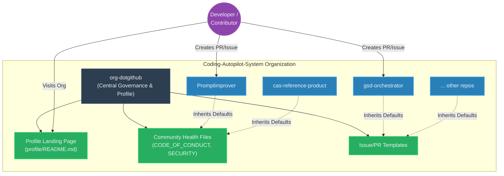

# Organization Architecture and Governance

This document outlines the architecture and logical flow of the `org-dotgithub` repository within the broader **Coding-Autopilot-System (CAS)** ecosystem.

## Logical Architecture

The `org-dotgithub` repository acts as the governance and standardization hub. GitHub automatically falls back to this repository for any organization repository that lacks specific health files or issue templates.

### Organization Fallback Mechanism

## Portfolio Map Integration

As the central hub, this repository documents the relationship between all CAS core components:

1. **Foundations**: `cas-contracts`, `cas-platform`, `cas-evals`
2. **Flagship Engines**: `gsd-orchestrator`, `Promptimprover`, `autogen`
3. **Reference Implementations**: `cas-reference-product`
4. **Workstation Environment**: `cas-workstation`

By centralizing the `profile/README.md`, `org-dotgithub` ensures that structural updates to the CAS portfolio only need to be published in one place, automatically updating the organization's public-facing GitHub profile.
