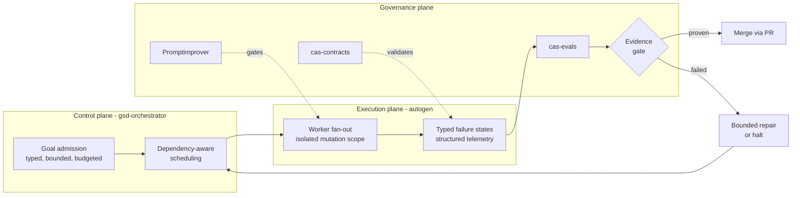

# Coding-Autopilot-System

> **Speed without governance creates risk. Governance without speed creates irrelevance.**
> Read the full thesis in **[our Vision](VISION.md)**.

AI-native engineering portfolio: autonomous multi-agent execution, prompt governance, versioned
lifecycle contracts, and Azure-ready platform foundations — every gate machine-executable and
evidence-producing, not a meeting.

> [!TIP]
> Are you an enterprise engineering leader? Read **[Why Enterprises Need CAS](ENTERPRISE.md)**.

## Governed autonomy, in one diagram

Full narrative, proof points, and every gate's falsifiable check: **[profile/VISION.md](VISION.md)**.

## Repo map

| Repo | Plane / category | What it does |
|---|---|---|
| [gsd-orchestrator](https://github.com/Coding-Autopilot-System/gsd-orchestrator) | Control | Autonomous issue-to-PR engine (.NET 10); goal admission and scheduling |
| [autogen](https://github.com/Coding-Autopilot-System/autogen) | Execution | Multi-agent worker fan-out on Microsoft Agent Framework (Python) |
| [Promptimprover](https://github.com/Coding-Autopilot-System/Promptimprover) | Governance | MCP-first prompt governance and traceability |
| [cas-contracts](https://github.com/Coding-Autopilot-System/cas-contracts) | Governance | Versioned lifecycle schemas — prompts, events, artifacts, `FailureState` |
| [cas-evals](https://github.com/Coding-Autopilot-System/cas-evals) | Governance | Deterministic evaluation and evidence-gate verification |
| [cas-reference-product](https://github.com/Coding-Autopilot-System/cas-reference-product) | Proof | End-to-end reference workload with a [verified case study](https://github.com/Coding-Autopilot-System/cas-reference-product/blob/main/docs/case-study-evidence.md) |
| [cas-platform](https://github.com/Coding-Autopilot-System/cas-platform) | Platform | Azure hosting/observability foundation — bicep-ready, deploy-locked |
| [cloud-security-service-model](https://github.com/Coding-Autopilot-System/cloud-security-service-model) | Platform | Enterprise cloud security operating model |
| [cas-workstation](https://github.com/Coding-Autopilot-System/cas-workstation) | Workstation | Windows-first AI-native developer workstation bootstrap |
| [autopilot-core](https://github.com/Coding-Autopilot-System/autopilot-core) | CI Automation | Control plane for org-level CI repair automation |
| [ci-autopilot](https://github.com/Coding-Autopilot-System/ci-autopilot) | CI Automation | Worker/runtime for queued repair execution on self-hosted runners |
| [autopilot-demo](https://github.com/Coding-Autopilot-System/autopilot-demo) | CI Automation | Bounded demo target for the full failure-to-fix loop |
| [.github (this repo)](https://github.com/Coding-Autopilot-System/.github) | Org | Governance, community health files, and this profile |

## Review path

Evaluating this portfolio quickly? Read in this order:

1. **[Vision](VISION.md)** — the governance-with-speed thesis and proof points.
2. **[Verified case study](https://github.com/Coding-Autopilot-System/cas-reference-product/blob/main/docs/case-study-evidence.md)** — real evidence, not a demo script.
3. **[cas-workstation](https://github.com/Coding-Autopilot-System/cas-workstation)** — the reproducible developer baseline.
4. **[cas-contracts](https://github.com/Coding-Autopilot-System/cas-contracts)** — shared lifecycle and traceability model.
5. **[gsd-orchestrator](https://github.com/Coding-Autopilot-System/gsd-orchestrator)** — autonomous execution design.

## What this portfolio demonstrates

- C#/.NET, TypeScript, Python, PowerShell, and Bicep across one coherent platform story
- Versioned cross-repository contracts and reproducible evaluation evidence
- MCP integration as infrastructure, not just local tooling
- Multi-agent and autonomous workflow design with operational guardrails
- Enterprise-oriented concerns: auditability, resilience, boundaries, rollout, and documentation
- Azure managed identity, infrastructure-as-code, observability, and hybrid architecture

## Organization standards

Shared contribution, security, support, governance, intake, dependency, and release policies are
maintained in this [organization `.github` repository](https://github.com/Coding-Autopilot-System/.github).
Repository-specific standards may be stricter.

Built by [@OgeonX-Ai](https://github.com/OgeonX-Ai).

<!-- docs-verified: 46b4bcf4e334ce9aec4e00dcf7c9fb1c40db837a 2026-07-08 -->
