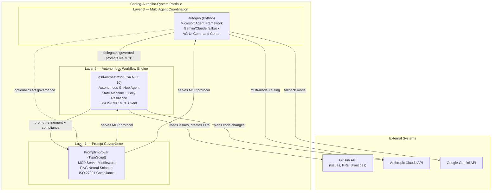

# Coding-Autopilot-System

An enterprise-grade AI automation platform built at the intersection of autonomous agents,
prompt governance, and multi-agent coordination.

Three production-quality systems — written in C#/.NET 10, TypeScript, and Python —
that demonstrate how AI agents should be built for real-world reliability, compliance, and scale.

## System Architecture

## Projects

### [gsd-orchestrator](https://github.com/Coding-Autopilot-System/gsd-orchestrator) — Autonomous GitHub Agent

**C# / .NET 10** — Reads GitHub issues and autonomously plans, branches, edits, and opens PRs
using Claude AI. Implements a state machine with Polly resilience, file checkpointing for
durability, and a JSON-RPC MCP stdio client for prompt governance integration.

**Enterprise patterns:** State machine, dependency injection, Polly resilience policies, structured logging, async/await throughout with CancellationToken propagation.

---

### [Promptimprover](https://github.com/Coding-Autopilot-System/Promptimprover) — Prompt Governance MCP Server

**TypeScript** — MCP server middleware implementing prompt governance as a first-class
infrastructure concern. RAG-based neural snippet retrieval, compounding memory, auto-heal
middleware, and ISO 27001 compliance framing.

**Enterprise patterns:** MCP protocol server, RAG architecture, middleware pipeline, compliance-first design.

---

### [autogen](https://github.com/Coding-Autopilot-System/autogen) — Multi-Agent Coordination

**Python** — Multi-agent automation built on Microsoft AutoGen with model-fallback resilience
(Anthropic Claude / Google Gemini), AG-UI Command Center for agent state observability,
and DevUI integration for operator-in-the-loop control.

**Enterprise patterns:** Agent framework integration, model-fallback routing, observability tooling, operator control plane.

---

## Technology Coverage

| Area | Technologies |
|------|-------------|
| Languages | C# / .NET 10 · TypeScript · Python |
| AI Providers | Anthropic Claude · Google Gemini |
| Protocols | Model Context Protocol (MCP) · JSON-RPC 2.0 |
| Patterns | State machine · RAG · Multi-agent coordination |
| Resilience | Polly retry/circuit-breaker · Model fallback routing |
| Infrastructure | GitHub Actions · GitHub API · GitHub MCP Server |
| Compliance | ISO 27001 framing |

---

Built by [@OgeonX-Ai](https://github.com/OgeonX-Ai) — AI Engineer and Senior .NET Developer
