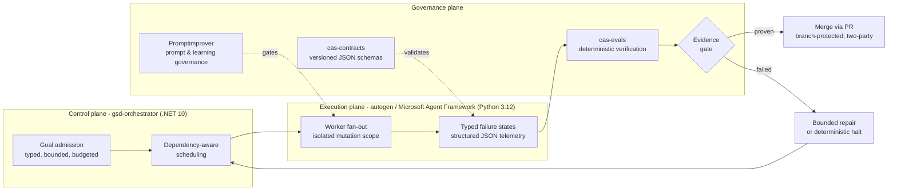
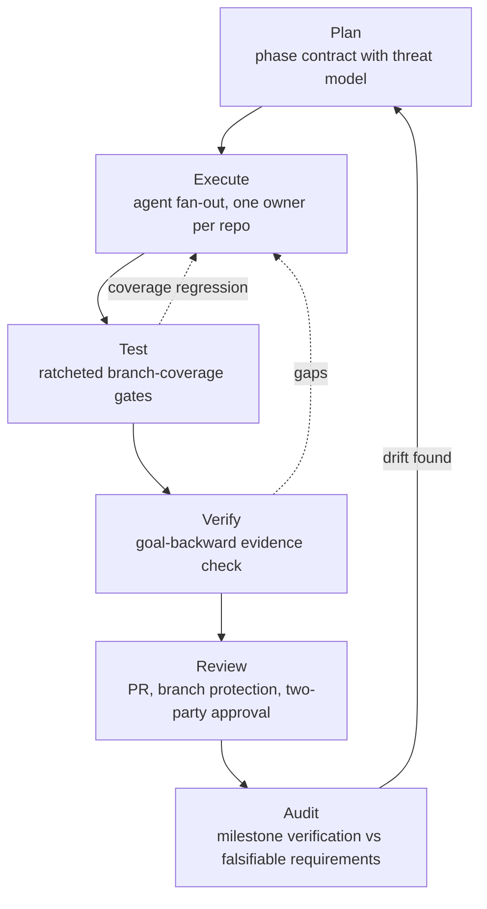
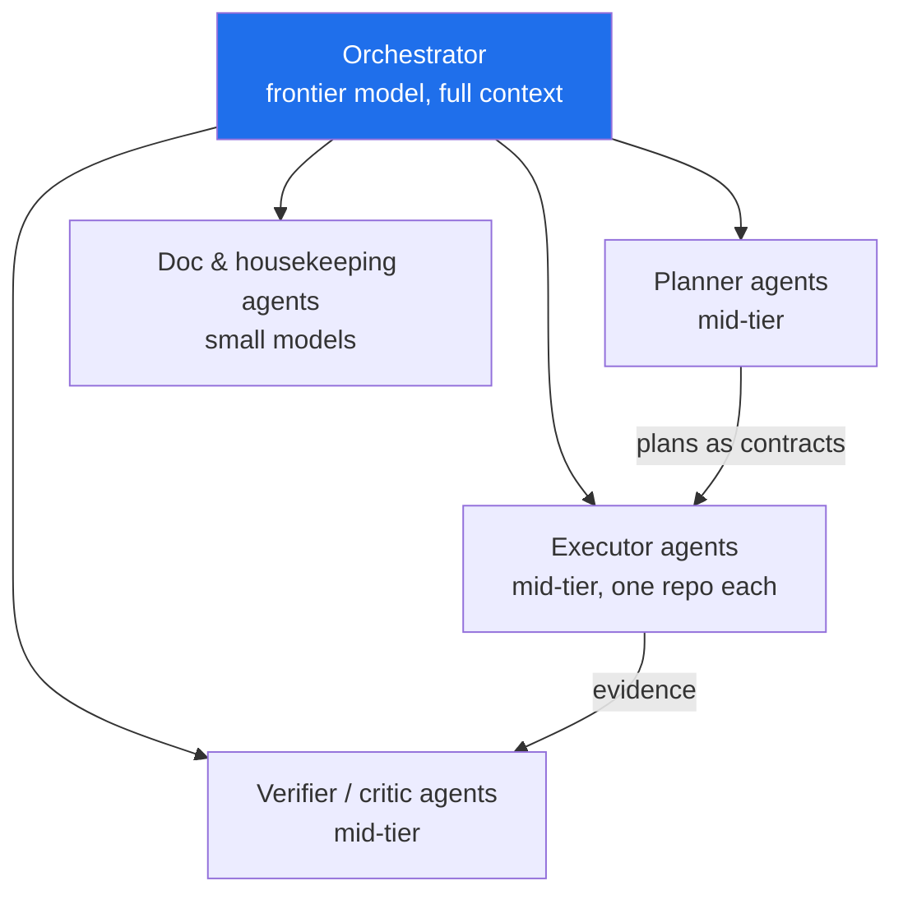

# CAS — Governed Autonomy for Software Delivery

> **Speed without governance creates risk. Governance without speed creates irrelevance.**
> CAS (Coding-Autopilot-System) is built on the position that this is a false trade-off: when governance is executable — schemas, gates, and evidence instead of meeting minutes — it *is* the speed.

<!-- codex:generate-image prompt="Hero banner: an assembly line where autonomous robot arms write code, and every station has a transparent glass quality gate stamping a green seal; isometric, enterprise blue/graphite palette, subtle circuit motifs, wide banner format" style="isometric, enterprise, clean" replaces="none" -->

This page is the organization-facing version of the flagship vision document. It exists so
anyone landing on [github.com/Coding-Autopilot-System](https://github.com/Coding-Autopilot-System)
can read the thesis and reach every repository behind it without cloning anything first.

## The problem

Every enterprise is discovering the same thing: AI agents can produce code far faster than humans can review it. The standard responses both fail —

- **Ship it** (speed without governance): untracked artifacts, untruthful commit messages, unreviewed merges, silent drift. We have measured versions of each of these failure classes in our own workspace — including a commit that *claimed* to add test suites while its diff contained none.
- **Board it** (governance without speed): review queues, manual sign-off, documentation that decays the day it's written. The agents idle; the advantage evaporates.

CAS is a working system — 13 repositories in this organization plus a workstation control plane — that resolves the tension by making every governance control **machine-executable and evidence-producing**.

## The answer: governed autonomy

<!-- codex:generate-image prompt="Three interlocking gears labeled Control, Execution, Governance, each gear containing small icons (calendar/scheduler, robot workers, shield with checkmark); flowing conveyor of code artifacts passing through a glowing evidence gate; isometric, enterprise blue/graphite" style="isometric, enterprise, clean" replaces="mermaid-above" -->

Three planes, strictly separated, each owned by a repository in this organization:

| Plane | Owner | What it enforces |
|---|---|---|
| **Control** | [`gsd-orchestrator`](https://github.com/Coding-Autopilot-System/gsd-orchestrator) | Goals are typed, measurable, bounded. Nothing runs without a budget and a stop rule. |
| **Execution** | [`autogen`](https://github.com/Coding-Autopilot-System/autogen) (MAF workers) | Every worker owns its mutation scope exclusively. Failures are *typed states*, never stack-trace soup. |
| **Governance** | [`Promptimprover`](https://github.com/Coding-Autopilot-System/Promptimprover), [`cas-contracts`](https://github.com/Coding-Autopilot-System/cas-contracts), [`cas-evals`](https://github.com/Coding-Autopilot-System/cas-evals) | Prompts, schemas, and verification are versioned artifacts. Completion requires deterministic evidence — an agent saying "done" is not evidence. |

## Every change runs the same SDLC loop

<!-- codex:generate-image prompt="Circular racetrack with six pit-stop stations labeled Plan, Execute, Test, Verify, Review, Audit; a sleek car made of code symbols racing through; each station has a gate barrier that only opens on green; isometric, enterprise" style="isometric, enterprise, clean" replaces="mermaid-above" -->

The loop is not aspirational — each gate is a running control with a falsifiable check:

- **Truthful history**: a commit-integrity check flags any `test:`-typed commit whose diff contains no test files (built after catching a real one).
- **Ratcheted coverage**: CI gates fail on branch-coverage regression and only ratchet upward with real tests — never a hardcoded aspirational 100%.
- **Typed failures**: a versioned `FailureState` schema in `cas-contracts`; orchestrator and workers map every boundary failure to it, proven by fault injection (process kills, corrupted checkpoints, simulated API outages).
- **Supply-chain pinning**: every third-party GitHub Action pinned to a commit SHA with least-privilege token scopes, verified by an org-wide lint that runs in CI.
- **Drift detection**: a daily workspace-health sweep runs 11 checks (unpushed work, orphaned artifacts, stale PRs, encoding hazards, broken worktrees) and exits non-zero on any finding.
- **Deploy lock as policy**: infrastructure is maintained "bicep-ready" — linted, parameterized, pinned — while an operator hard lock prevents any cloud deployment until it is deliberately lifted. Governance includes what you *don't* ship.

## Modular agents, priced to the task

<!-- codex:generate-image prompt="Organizational chart of robots: one large conductor robot on top with a baton, delegating to rows of medium specialist robots (blueprint, wrench, magnifying glass icons) and small clerk robots with clipboards; price tags shrink down the hierarchy; isometric, enterprise" style="isometric, enterprise, clean" replaces="mermaid-above" -->

The orchestrator delegates through **typed sub-agents** (planner, executor, verifier, critic, doc-writer), each with a scoped toolset and an explicitly chosen model tier — frontier reasoning only where it pays, small models for mechanical work. Specialist agents deliberately *cannot* spawn their own sub-agents; delegation depth is a governance decision, not an accident. The result: parallel throughput of a team, token cost of a task queue, and an audit trail for every decision.

## Proof points (v1.4 hardening milestone, one working week)

- 25-PR release train merged across 13 repos with branch protection never left disabled.
- 2 orphaned test suites recovered and gated; coverage baselines measured and ratcheted (branch coverage, not vanity line metrics).
- 37 + 16 new tests landed via fault injection and coverage phases; 134-test suites green.
- 4 stranded commits, 11 unmerged agent branches, and 14 broken worktrees detected and recovered — zero work lost.
- Every finding became a permanent automated check the same week it was found.

## Explore the 13 repositories

Every plane above is backed by a real, buildable repository in this organization. Start
wherever matches your interest:

| Repository | Role | Plane / category |
|---|---|---|
| [gsd-orchestrator](https://github.com/Coding-Autopilot-System/gsd-orchestrator) | Autonomous issue-to-PR engine; goal admission and scheduling | Control |
| [autogen](https://github.com/Coding-Autopilot-System/autogen) | Multi-agent worker fan-out on Microsoft Agent Framework | Execution |
| [Promptimprover](https://github.com/Coding-Autopilot-System/Promptimprover) | MCP-first prompt governance and traceability | Governance |
| [cas-contracts](https://github.com/Coding-Autopilot-System/cas-contracts) | Versioned lifecycle schemas (prompts, events, artifacts, `FailureState`) | Governance |
| [cas-evals](https://github.com/Coding-Autopilot-System/cas-evals) | Deterministic evaluation and evidence-gate verification | Governance |
| [cas-reference-product](https://github.com/Coding-Autopilot-System/cas-reference-product) | End-to-end reference workload with a [verified case study](https://github.com/Coding-Autopilot-System/cas-reference-product/blob/main/docs/case-study-evidence.md) | Proof |
| [cas-platform](https://github.com/Coding-Autopilot-System/cas-platform) | Azure hosting/observability foundation — bicep-ready, deploy-locked | Platform |
| [cloud-security-service-model](https://github.com/Coding-Autopilot-System/cloud-security-service-model) | Enterprise cloud security operating model | Platform |
| [cas-workstation](https://github.com/Coding-Autopilot-System/cas-workstation) | Windows-first AI-native developer workstation bootstrap | Workstation |
| [autopilot-core](https://github.com/Coding-Autopilot-System/autopilot-core) | Control plane for org-level CI repair automation | CI Automation |
| [ci-autopilot](https://github.com/Coding-Autopilot-System/ci-autopilot) | Worker/runtime for queued repair execution on self-hosted runners | CI Automation |
| [autopilot-demo](https://github.com/Coding-Autopilot-System/autopilot-demo) | Bounded demo target for the full failure-to-fix loop | CI Automation |
| [.github (this repo)](https://github.com/Coding-Autopilot-System/.github) | Org governance, community health files, and this profile | Org |

For a shorter front-door version of this page, see the
[organization profile README](https://github.com/Coding-Autopilot-System/.github/blob/main/profile/README.md).

---

*This page is adapted from the canonical `docs/VISION.md`, maintained at the root of the CAS
workstation workspace — the source of truth for this thesis, tone, and diagram style. See each
repository's own `docs/wiki/` for implementation-level detail. Diagrams are Mermaid-first;
`codex:generate-image` placeholders mark where generated visuals will replace them.*
<!-- docs-verified: 46b4bcf4e334ce9aec4e00dcf7c9fb1c40db837a 2026-07-08 -->
